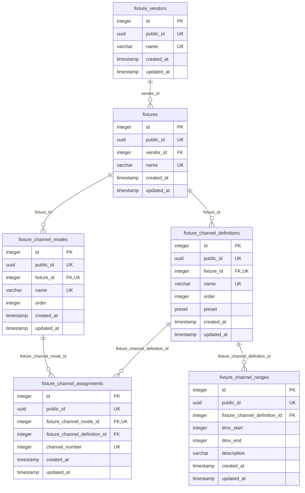

# Database Schema

> Auto-generated by `nx run backend:erd`. Do not edit manually.

```mermaid
erDiagram
    fixture_vendors ||--o{ fixtures : "vendor_id"
    fixture_channel_modes ||--o{ fixture_channel_assignments : "fixture_channel_mode_id"
    fixture_channel_definitions ||--o{ fixture_channel_assignments : "fixture_channel_definition_id"
    fixtures ||--o{ fixture_channel_definitions : "fixture_id"
    fixtures ||--o{ fixture_channel_modes : "fixture_id"
    fixture_channel_definitions ||--o{ fixture_channel_ranges : "fixture_channel_definition_id"
    fixtures {
        integer id PK
        uuid public_id UK
        integer vendor_id FK
        varchar name UK
        timestamp created_at
        timestamp updated_at
    }
    fixture_channel_assignments {
        integer id PK
        uuid public_id UK
        integer fixture_channel_mode_id FK,UK
        integer fixture_channel_definition_id FK
        integer channel_number UK
        timestamp created_at
        timestamp updated_at
    }
    fixture_channel_definitions {
        integer id PK
        uuid public_id UK
        integer fixture_id FK,UK
        varchar name UK
        integer order
        preset preset
        timestamp created_at
        timestamp updated_at
    }
    fixture_channel_modes {
        integer id PK
        uuid public_id UK
        integer fixture_id FK,UK
        varchar name UK
        integer order
        timestamp created_at
        timestamp updated_at
    }
    fixture_channel_ranges {
        integer id PK
        uuid public_id UK
        integer fixture_channel_definition_id FK
        integer dmx_start
        integer dmx_end
        varchar description
        timestamp created_at
        timestamp updated_at
    }
    fixture_vendors {
        integer id PK
        uuid public_id UK
        varchar name UK
        timestamp created_at
        timestamp updated_at
    }
```
